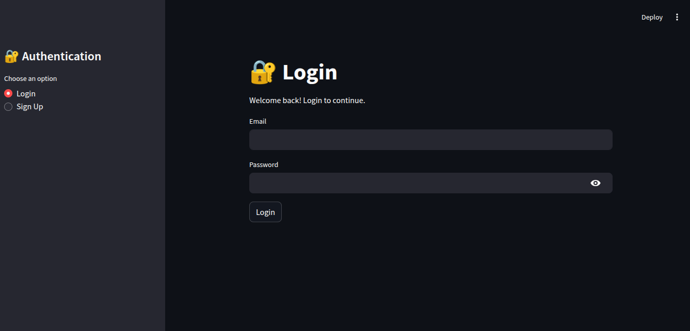
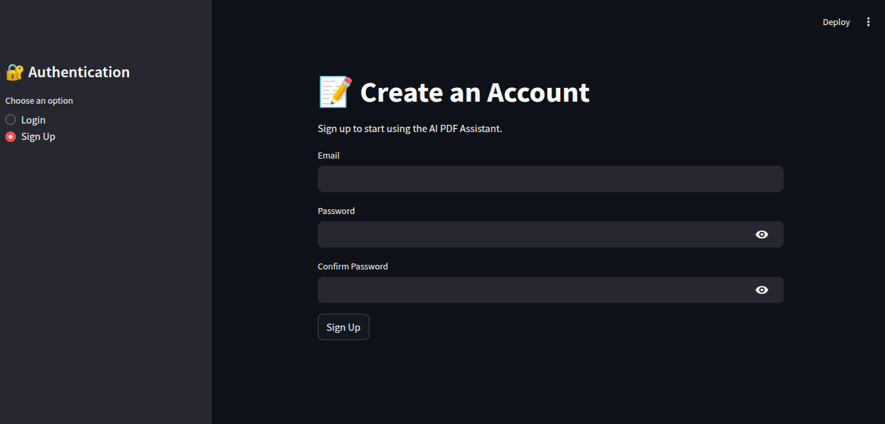
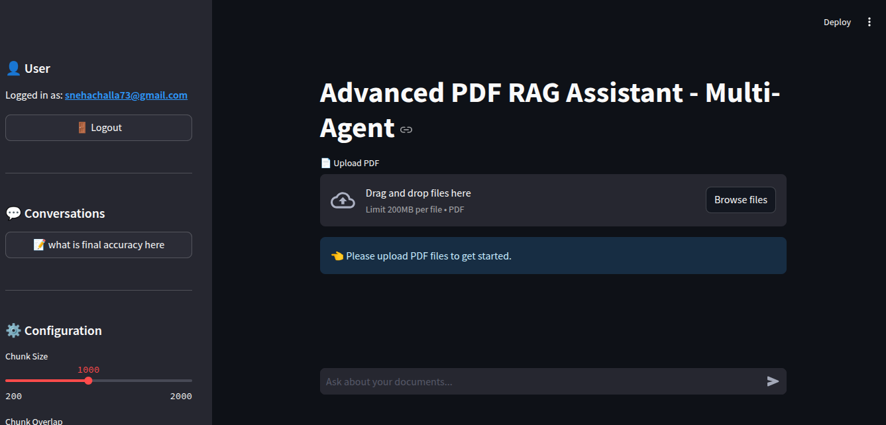
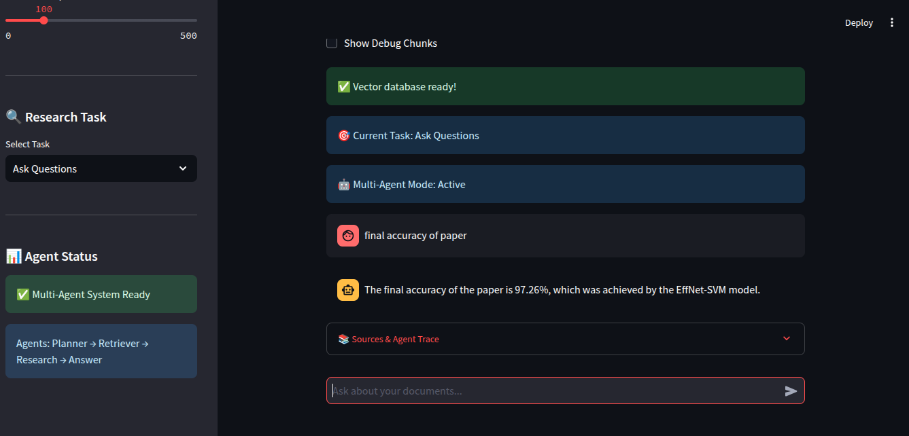

# 🤖 AI-Powered PDF Research Assistant using RAG

An advanced Retrieval-Augmented Generation (RAG) application for intelligent PDF question answering. Built using Streamlit, LangChain, ChromaDB, Sentence Transformers, Groq LLM, and Supabase, this project enables users to upload PDF documents, ask natural language questions, and receive context-aware responses powered by semantic search and Large Language Models.

---

# ✨ Features

### 🔐 Authentication
- User Sign Up & Login
- Session Management
- Secure Authentication using Supabase
  # 📸 Application Screenshots

## 🔐 Login



---

## 📝 Sign Up



---

## 📊 Dashboard



---

## 💬 AI Research Assistant



### 📚 PDF Processing
- Upload one or multiple PDF documents
- Automatic text extraction
- Intelligent text chunking

### 🧠 Retrieval Pipeline
- Dense Vector Search
- Hybrid Retrieval (Semantic + Keyword Search)
- Cross-Encoder Reranking
- Context-aware document retrieval

### 💬 Conversational AI
- Chat history memory
- Context-aware conversations
- Groq LLM powered answer generation

### 🤖 AI Agents
- Planner Agent
- Retrieval Agent
- Research Agent
- Answer Generation Agent

### 📄 Research Assistant
- PDF Summarization
- Literature Review Generation
- Research Gap Identification
- Citation Generation
- PDF Comparison

### ☁️ Database
- Supabase Authentication
- Chat History Storage
- User Session Management

### 🎨 User Interface
- Interactive Streamlit Interface
- Multi-document support
- Real-time responses

---

# 🏗️ Project Structure

```text
PDF-RAG-CHATBOT/
│
├── app.py
├── graph.py
├── requirements.txt
├── README.md
│
├── agents/
│   ├── planner_agent.py
│   ├── retriver_agent.py
│   ├── research_agent.py
│   └── answer_agent.py
│
├── auth/
│   ├── auth.py
│   ├── login.py
│   ├── sign_up.py
│   └── session.py
│
├── database/
│   ├── db.py
│   └── supabase.py
│
├── utils/
│   ├── pdf_loader.py
│   ├── chunker.py
│   ├── embeddings.py
│   ├── vector_store.py
│   ├── retriver.py
│   ├── hybrid_retriver.py
│   ├── reranker.py
│   ├── memory.py
│   ├── llm.py
│   ├── prompt.py
│   ├── summary_prompt.py
│   ├── comparison_prompt.py
│   ├── literature_review_prompt.py
│   ├── research_gap_prompt.py
│   └── citation_prompt.py
│
├── chroma_db/
│
└── incoming/
```

---

# ⚙️ Tech Stack

- Python
- Streamlit
- LangChain
- ChromaDB
- Sentence Transformers
- Groq LLM
- Supabase
- PyPDF
- BM25 Hybrid Retrieval
- Cross Encoder Reranking

---

# 🚀 Installation

Clone the repository

```bash
git clone https://github.com/snehachalla9/Agentic-PDF-Research-Assistant.git
cd Agentic-PDF-Research-Assistant.git
```

Create a virtual environment

```bash
python -m venv venv
```

Activate it

### Linux / macOS

```bash
source venv/bin/activate
```

### Windows

```bash
venv\Scripts\activate
```

Install dependencies

```bash
pip install -r requirements.txt
```

---

# 🔑 Environment Variables

Create a `.env` file in the project root.

```env
GROQ_API_KEY=your_groq_api_key

SUPABASE_URL=your_supabase_url

SUPABASE_KEY=your_supabase_anon_key
```

---

# ▶️ Run the Application

```bash
streamlit run app.py
```

---

# 🔄 Workflow

```text
User
   │
   ▼
Login / Sign Up
   │
   ▼
Upload PDF(s)
   │
   ▼
Text Extraction
   │
   ▼
Chunking
   │
   ▼
Embedding Generation
   │
   ▼
ChromaDB Storage
   │
   ▼
Hybrid Retrieval
   │
   ▼
Cross Encoder Reranking
   │
   ▼
LLM Answer Generation
   │
   ▼
Response + Chat History
```

---

# 📌 Example Use Cases

- Research Paper Analysis
- Academic Question Answering
- Resume Analysis
- Policy Document Search
- Literature Review Generation
- Citation Generation
- Research Gap Detection
- Enterprise Knowledge Base
- Technical Documentation Assistant

---

# 🚀 Future Enhancements

- OCR Support for Scanned PDFs
- Image Understanding using Vision Models
- Multi-modal RAG
- Web Search Integration
- Citation Verification
- Voice-based Question Answering
- Docker Deployment
- Kubernetes Deployment

---

# ☁️ Deployment

The application can be deployed on

- Streamlit Community Cloud

---


# 👩‍💻 Author

**Sneha Challa**

Electronics and Communication Engineering  
Rajiv Gandhi University of Knowledge Technologies (RGUKT), Basar

GitHub: https://github.com/snehachalla9

---

# ⭐ Support

If you found this project helpful, consider giving it a ⭐ on GitHub!
